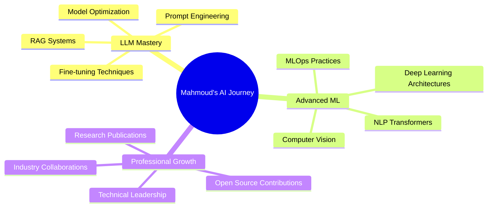

# 🚀 Mahmoud Abdulhamid | AI Engineer & Researcher

---

## 🎯 Professional Overview

<table>
<tr>
<td width="50%">

### 🔬 Current Focus
- **Advanced AI & NLP Projects**
  - LLM Applications & Fine-tuning
  - Sentiment Analysis Systems
  - Groq Cloud Model Integration
  - LangChain SQL Chatbots

### 🤝 Collaboration Interests
- AI & ML Research Projects
- NLP & Generative AI Solutions
- Open-source AI Contributions
- Deep Learning Applications

</td>
<td width="50%">

### 🎓 Learning & Growth
- **Large Language Models**
  - Fine-tuning Techniques
  - Model Optimization
  - Advanced Architectures

### 💡 Expertise Areas
- Machine Learning & NLP
- Deep Learning Frameworks
- AI-powered Chatbots
- Algorithm Design & Problem Solving

</td>
</tr>
</table>

---

## 🌐 Connect With Me

**Competitive Programming & Data Science**

 

---

## 💻 Technology Stack

### 🔥 Core Programming Languages

### 🧠 AI/ML & Deep Learning

### 📊 Data Science & Analytics

### 🗄️ Databases

### ☁️ Cloud & DevOps

### 🔧 Tools & Platforms

---

## 📊 GitHub Analytics Dashboard

### 📈 Performance Metrics

### 💼 Language Proficiency

### 🏆 GitHub Trophies

### 📊 Contribution Graph

---

## 🚀 Featured Projects

| Project | Description | Tech Stack |
|---------|-------------|------------|
| 🤖 **LangChain SQL Chatbot** | Advanced chatbot for database interactions | Python, LangChain, SQL, NLP |
| 🧠 **Sentiment Analysis System** | Real-time emotion detection from text | Python, TensorFlow, BERT |
| ⚡ **Groq Cloud Integration** | High-performance LLM applications | Python, Groq API, FastAPI |
| 📊 **ML Model Deployment** | End-to-end ML pipeline | Python, Docker, AWS, MLOps |

---

## 💡 Current Learning Focus

---

### 🌟 "Turning Data into Intelligence, Code into Innovation"

**Thank you for visiting my profile! Let's connect and build the future of AI together! 🚀**

---

<!-- Proudly created with GPRM ( https://gprm.itsvg.in ) and enhanced with Claude Code -->
