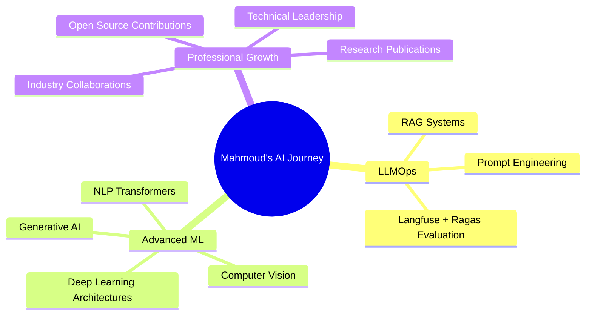

# Mahmoud Abdulhamid | Professional AI Engineer

<div align="center">

[](https://git.io/typing-svg)

[](https://drive.google.com/file/d/1r6uyzLukdPzAfG7ti8etP_xqhSu6jyeO/view?usp=sharing)

</div>

---

## 🎯 Professional Overview

As a dedicated **AI Engineer**, I specialize in developing and deploying **production-grade AI systems**. My expertise spans **Retrieval-Augmented Generation (RAG)**, **Multi-Agent Architectures**, and **LLM Evaluation & Observability**. I am passionate about leveraging cutting-edge AI to solve complex problems, particularly in the domains of **Financial and Medical AI Assistants**.

### 🔬 Key Focus Areas

*   **Production-Grade AI Systems**
    *   Retrieval-Augmented Generation (RAG)
    *   Multi-Agent Architectures
    *   LLM Evaluation & Observability (Langfuse, Ragas)
*   **Applied Research & Development**
    *   Financial & Medical AI Assistants
    *   NLP & Generative AI Pipelines
    *   High-performance LLM inference (Groq Cloud)
*   **Continuous Learning & Growth**
    *   Large Language Models: Fine-tuning & Optimization, Prompt Engineering, Evaluation Frameworks
    *   End-to-End AI Application Development
    *   ML & Deep Learning Frameworks
    *   AI-powered Chatbots & Assistants
    *   Cloud-Native Deployment & MLOps

### 🤝 Collaboration Interests

I am actively seeking collaboration opportunities in:

*   Enterprise AI Engineering
*   RAG/LLMOps Product Development
*   Open-source AI Tool Contributions
*   Applied Machine Learning Research

---

## 🌐 Connect With Me

<div align="center">

[](https://linkedin.com/in/mahmoud-abdulhamid-052244230)
[](mailto:mahmoudabdulhamid22@gmail.com)
[](https://www.upwork.com/freelancers/~0158579418b57b95a7)

### Competitive Programming & Data Science Profiles

[](https://leetcode.com/u/0x100/)
[](https://codeforces.com/profile/0x100)
[](https://www.kaggle.com/triblex)

</div>

---

## 💻 Technology Stack

My technical toolkit includes a diverse range of programming languages, AI/ML frameworks, and cloud technologies, enabling me to build robust and scalable AI solutions.

<div align="center">

### 🔥 Core Programming


### 🧠 AI/ML & LLMOps


### ☁️ Cloud & DevOps


</div>

---

## 🚀 Featured Projects

Here are some of my notable projects that showcase my expertise in building practical AI solutions:

<div align="center">

| Project | Description | Tech Stack |
|---------|-------------|------------|
| 🏢 **Enterprise RAG Platform** | FastAPI service for multi-document RAG with OCR & embeddings | Python, FastAPI, LangChain, Qdrant, Docker |
| 🏥 **Medical RAG Chatbot** | Clinical assistant with FAISS retrieval, memory & Langfuse telemetry | Python, Flask, FAISS, OpenAI, Langfuse |
| 💹 **Multi-Agent Financial Researcher** | Phidata agents orchestrating finance/news workflows | Python, Phidata, Groq LLMs, YFinance |
| 🎌 **AnimeGPT-LLMOps (Personal)** | RAG recommender deployed with Docker + K8s + Grafana | Python, Streamlit, ChromaDB, Groq, Langfuse |

</div>

---

## 📊 GitHub Analytics Dashboard

An overview of my GitHub activity and contributions:

<div align="center">


</div>

---

## 💡 Current Learning Focus

My ongoing learning journey is centered around these key areas:

<div align="center">


```mermaid
mindmap
  root((Mahmoud's AI Journey))
    LLMOps
      RAG Systems
      Langfuse + Ragas Evaluation
      Prompt Engineering
    Advanced ML
      Deep Learning Architectures
      Computer Vision
      NLP Transformers
      Generative AI
    Professional Growth
      Open Source Contributions
      Industry Collaborations
      Research Publications
      Technical Leadership
```
```
</div>
