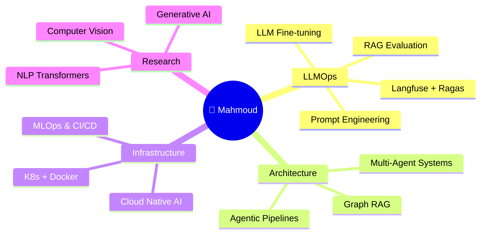

<div align="center">

</div>

<div align="center">

[](https://git.io/typing-svg)

<br/>

<a href="https://showcase-so-good--mahmoudabdulha2.replit.app/#contact">
  
</a>
&nbsp;
<a href="https://drive.google.com/file/d/1r6uyzLukdPzAfG7ti8etP_xqhSu6jyeO/view?usp=sharing">
  
</a>

<br/><br/>


</div>

---

## 👨‍💻 Who Am I?


```yaml
name:     Mahmoud Abdulhamid
role:     AI Engineer & LLMOps Specialist
location: Egypt 🇪🇬
focus:
  - Production-grade RAG Systems
  - Multi-Agent AI Architectures
  - LLM Evaluation & Observability
currently_building:
  - Enterprise document intelligence platforms
  - Financial & Medical AI assistants
open_to:
  - Freelance AI projects
  - Research collaborations
  - Open-source contributions
superpower: "Turning LLM demos into production systems"
```

<br clear="right"/>

---

## 🛠️ Tech Arsenal

<div align="center">

### Languages


### AI / ML / LLMOps


<br/>


### Cloud & DevOps


</div>

---

## 🚀 Featured Projects

<div align="center">

<a href="https://github.com/0Xuser100/AnimeGPT-LLMOps">

</a>
<a href="https://github.com/0Xuser100/AskPDF-RAG-DeepSeek-R1-32B-LangChain">

</a>

</div>

<br/>

<table align="center" width="100%">
<tr>
<td align="center" width="25%">
<br/><br/>
<b>Enterprise RAG Platform</b><br/><br/>
Multi-document FastAPI service with OCR, semantic chunking & vector embeddings<br/><br/>


</td>
<td align="center" width="25%">
<br/><br/>
<b>Medical RAG Chatbot</b><br/><br/>
Clinical Q&A assistant with FAISS retrieval, memory & full Langfuse telemetry<br/><br/>


</td>
<td align="center" width="25%">
<br/><br/>
<b>Multi-Agent Financial Researcher</b><br/><br/>
Orchestrated Phidata agents for live market data & news with Groq inference<br/><br/>


</td>
<td align="center" width="25%">
<br/><br/>
<b>AnimeGPT LLMOps</b><br/><br/>
RAG recommender with Docker + K8s deployment, Grafana monitoring & tracing<br/><br/>


</td>
</tr>
</table>

---

## 📊 GitHub Analytics

<div align="center">


<br/>


<br/>


</div>

---

## 🐍 Contribution Snake

<div align="center">
<picture>
  <source media="(prefers-color-scheme: dark)" srcset="https://raw.githubusercontent.com/0Xuser100/0Xuser100/output/github-snake-dark.svg" />
  <source media="(prefers-color-scheme: light)" srcset="https://raw.githubusercontent.com/0Xuser100/0Xuser100/output/github-snake.svg" />
  
</picture>
</div>

---

## 🧠 Current Learning Journey


```mermaid
mindmap
  root((🧠 Mahmoud))
    LLMOps
      RAG Evaluation
      Langfuse + Ragas
      Prompt Engineering
      LLM Fine-tuning
    Architecture
      Multi-Agent Systems
      Agentic Pipelines
      Graph RAG
    Infrastructure
      MLOps & CI/CD
      K8s + Docker
      Cloud Native AI
    Research
      NLP Transformers
      Computer Vision
      Generative AI
```

---

## 🌐 Let's Connect

<div align="center">

<a href="https://showcase-so-good--mahmoudabdulha2.replit.app/#contact">
  
</a>
<a href="https://linkedin.com/in/mahmoud-abdulhamid-052244230">
  
</a>
<a href="mailto:mahmoudabdulhamid22@gmail.com">
  
</a>
<a href="https://www.upwork.com/freelancers/~0158579418b57b95a7">
  
</a>

<br/><br/>

<a href="https://leetcode.com/u/0x100/">
  
</a>
<a href="https://codeforces.com/profile/0x100">
  
</a>
<a href="https://www.kaggle.com/triblex">
  
</a>

<br/><br/>


</div>

<div align="center">

</div>
